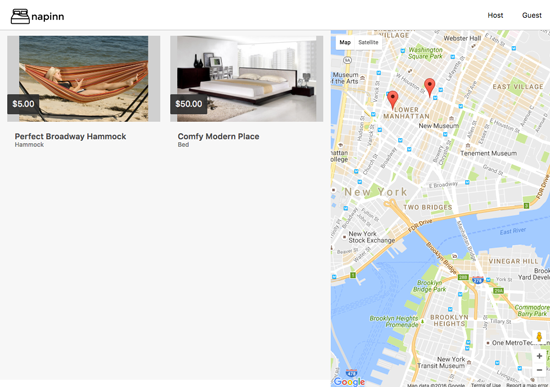
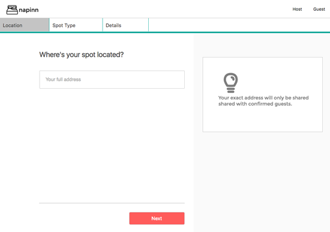
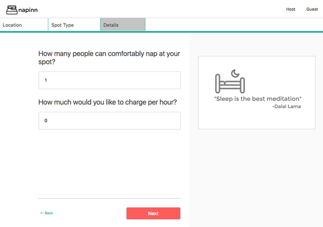
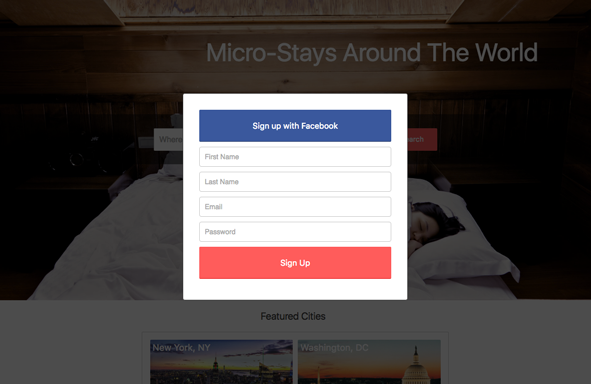

#NapInn#

[napinn.evanzarowitz.com](http://napinn.evanzarowitz.com)

NapInn is an AirBnB inspired full-stack web application, foused on micro-stays and naps as opposed to multi-night stays. It utilizes Ruby on Rails on the backend, a PostgreSQL database, and React.js with a Flux architectural framework on the frontend. NapInn extensively utilizes the Google Maps API for autocompletion and geolocation.

##Features & Implementation##

###Single-Page App###

NapInn is truly a single-page; all content is delivered on one static page, which makes requests to various API routes supplied by the backend. As a result, NapInn is robust, responsive, and secure for end-users. No sensitive user information, such as password hashes, full names, or addresses are ever extant in the frontend. Said architecture is also highly scalable.

All NapSpots (which users can create at will once logged in), are stored in one table in the database, which contains columns for id, owner_id, description, and category, location, price, capacity, and an image url . Users are able to browse NapSpots at will, but in order to make a booking, a user must be logged in. A booking is created after a user chooses a date, and one or many time-slots, which are hour intervals. The bookings table contains only essential information: napspot_id, napper_id, date, and reserved_blocks.

NapInn contains custom icons and visually appealing css to provide users with a highly pleasant experience.

####NapSpot####

NapSpots are rendered in an index view, with price, location, and categorical information, and also in a detail view, which fetches associated bookings and additional information such as the description.

####Index View####

####Detail View####

A series of elegant forms walks users through the process of creating a NapSpot, and allows users to upload an image to represent the NapSpot. A sample of the uploaded image is shown to the user before the NapSpot is saved to the database, allowing a final review before NapSpot creation. Once saved, the image is resized, padded, and optimized.

####Location Form Sample####

####Detail Form Sample####

NapSpots can be deleted only by their creators, who are able to do so within the 'mynapspots' component, which lists all NapSpots created by the current user.

Users, whether logged in or not, can search for and browse through NapSpot listings by entering a location in the search field, or by selecting a 'featured city'.

###Booking###

The booking functionality utilizes moment.js, a ubiquitous library used for working with datetime. A datetime picker is used to create bookings. The picker adds a listener on a bookings store, and disables any potential time slots already booked.

###User###

In order to book and create NapSpots, users must sign up or log in, which they can do via custom modal components. Users can create accounts by entering name, email, and password info manually, or by utilizing an existing Facebook account via OmniAuth. When accounts are created manually, the custom backend authentication scheme utilizes Bcrypt to store a secure hash of user passwords.

####Sign Up Modal and Omniauth####

##Future Directions for the Project##

NapInn is a work in progress. There are a few features that still need to be implemented, and some longer term goals. The next steps for NapInn are as follows.

Features to finish: User Profile, Editing of NapSpots

- **Filtering**

A user will be able to filter their search for any of the saved categories (type, capacity, price, etc.).

- **Direct Messaging**

Nappers and NapSpot owners will be able to chat and make arrangements in real time.

- **Custom Google Maps Markers**
